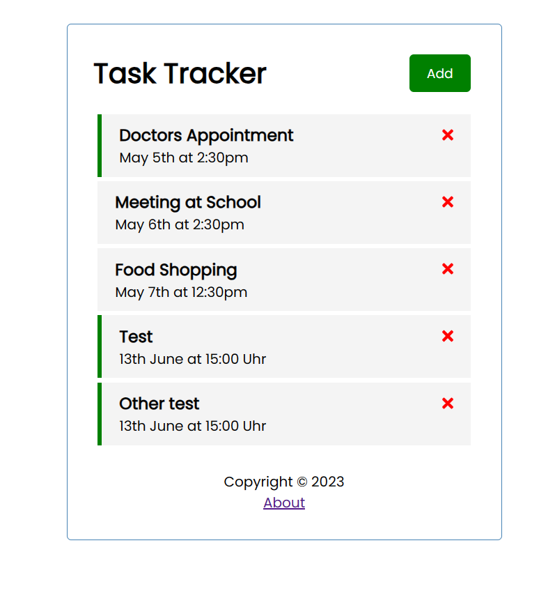
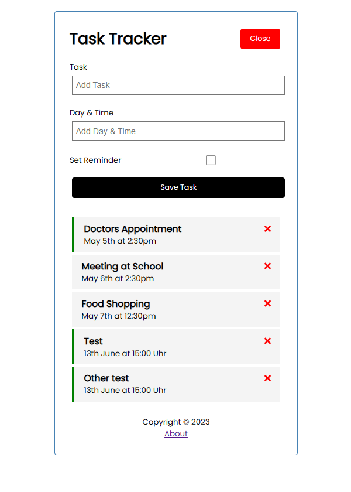
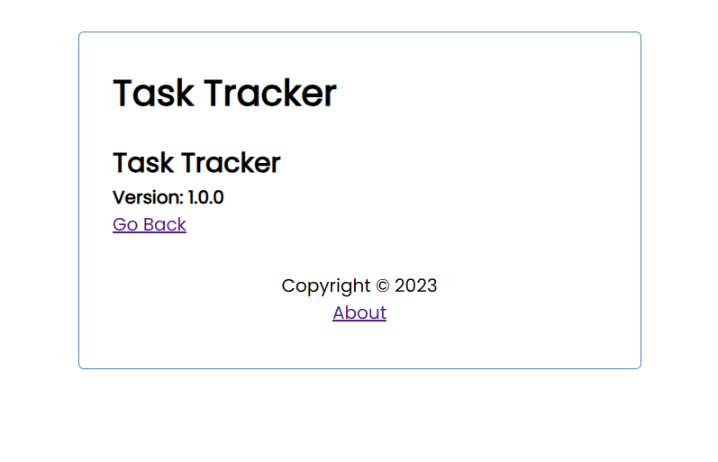

# TaskTracker

This project was generated with [Angular CLI](https://github.com/angular/angular-cli) version 16.0.4.

## Development server

Run `ng serve` for a dev server. Navigate to `http://localhost:4200/`. The application will automatically reload if you change any of the source files.

## Code scaffolding

Run `ng generate component component-name` to generate a new component. You can also use `ng generate directive|pipe|service|class|guard|interface|enum|module`.

## Features

- Create tasks: Users can add tasks by clicking the "Add" button. A form will appear where they can enter the task details such as the task name and reminder.
- Remove reminders: Users can remove the reminder for a task by double-clicking on the task. The reminder will be cleared, but the task will remain in the list.
- Delete tasks: Users can delete a task by clicking the "Delete" button next to the task. The task will be permanently removed from the list.
- Navigate to the about page: Users can navigate to the about page by clicking the "About" link in the footer. The about page provides information about the task tracker application

## Getting Started

To get started with the task tracker project, follow these steps:

1. Clone the repository: git clone `https://github.com/hardika-spec-610/task-tracker.git`

2. Navigate to the project directory: `cd task-tracker`

3. Install the dependencies: `npm install`

4. Start the development server: `ng serve`

5. Open your browser and visit: `http://localhost:4200/`

## Images

